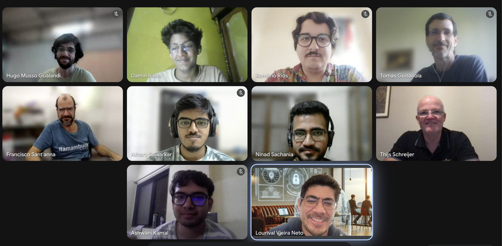

# GSoC 2026 Midterm Evaluation

All four contributors presented their progress to the mentors on **July 7th, 2026**. The four
projects went through the evaluation and are recorded as active on GSoC, carrying on into the
second half of the program.

*From left to right, top to bottom: Hugo Musso Gualandi, Damin Risho, Romário Rios, Tomás
Guisasola, Francisco Sant'Anna, Atharv Sawarkar, Ninad Sachania, Thijs Schreijer, Ashwani Kamal,
Lourival Vieira Neto.*

---

## [Evaluating Structured Reactive Patterns in Atmos](https://summerofcode.withgoogle.com/programs/2026/projects/tUI6CoLO)

**Contributor:** Atharv Sawarkar
**Mentor:** Francisco Sant'Anna
**Idea:** [Evaluating Structured Reactive Patterns in Atmos](../ideas.md#evaluating-structured-reactive-patterns-in-atmos)
**Presentation:** [slides (PDF)](assets/atmos-atharv-sawarkar.pdf)

The project ports [SNKRX](https://github.com/a327ex/SNKRX), a LÖVE game that exercises all five
control-flow patterns identified in the Pingus case study, to pico-atmos.

Progress at the midterm:

* **Menu screen:** Arena Run (start) button, options frame, quit button.
* **Shop screen:** snake unit cards rolling, reordering of snake units.
* **Battle screen:** snake construction, mouse target following, wall bouncing.
* **UI building blocks:** rich text, info popups, class banners, shop cards.

The second half continues the incremental port and the evaluation track (classifying the applied
patterns and comparing them with the original implementation).

---

## [Add Support for Prepared Statements in LuaSQL](https://summerofcode.withgoogle.com/programs/2026/projects/CybN2mc4)

**Contributor:** Damin Risho
**Mentors:** Tomás Guisasola, Thijs Schreijer
**Idea:** [Add support for prepared statements for LuaSQL](../ideas.md#add-support-for-prepared-statements-for-luasql)
**Presentation:** [slides (PDF)](assets/luasql-oci8-damin-risho.pdf)

The first half targeted the OCI8 (Oracle) driver. Done so far:

* Common prepared-statement API finalized, along with the LuaSQL datatype system
  (`luasql.type.*`).
* `conn:prepare()` implemented over `OCIStmtPrepare2`, plus `stmt:close()`, parameter validation
  and parameter binding.
* Test additions and fixes, and code review improvements.

Design decisions taken during the first half:

* **`stmt:bind()` was removed.** Parameters are now passed directly to `stmt:execute({...})`,
  supporting both positional and named binding.
* **A common type system** (`luasql.type.int`, `.number`, `.string`, `.timestamp`, `.date`,
  `.time`, `.null`, …) replaces driver-specific constants such as `SQLT_INT`, `MYSQL_TYPE_LONG`
  and `INT8OID`.
* **Explicit type conversion** at bind time.

Remaining: OCI8 `stmt_data`, `stmt:execute(params)` for DML, SELECT + cursor integration, and, if
time permits, the PostgreSQL implementation.

---

## [Improve the Pallene Installer](https://summerofcode.withgoogle.com/programs/2026/projects/LJlrW9TY)

**Contributor:** Ninad Sachania
**Mentors:** Hugo Musso Gualandi, Luiz Romário Santana Rios
**Idea:** [Improve the Pallene Installer](../ideas.md#improve-the-pallene-installer)
**Presentation:** [slides (PDF)](assets/pallene-ninad-sachania.pdf), titled "Improving the Build Process of Pallene"

Done so far:

* Vendored all dependencies, both Lua and C.
* Simplified the build process and **removed LuaRocks as a dependency** for building and
  installing Pallene.
* Rewrote the documentation and updated the CI.
* Side contributions: fixed a bug in Pallene Tracer and improved the `configure` script of
  xjump-sdl.

Reported benefits: fewer dependencies, protection against supply chain attacks, faster CI and
build times, improved robustness.

Second half: integrate Pallene Tracer into the special Lua, remove unnecessary code, make Pallene
work on macOS, Windows and WSL2, test portability, and write more documentation.

---

## [Lunatik eBPF Abstraction Layer: TC, Scheduler binding and eBPF Maps](https://summerofcode.withgoogle.com/programs/2026/projects/IHF0HPaF)

**Contributor:** Ashwani Kumar Kamal ([@sneaky-potato](https://github.com/sneaky-potato))
**Mentors:** Lourival Vieira Neto, Mohammad Shehar Yaar Tausif, Marcel Moura
**Ideas:** [Lunatik Binding for Linux Traffic Control (TC) and eBPF Maps](../ideas.md#lunatik-binding-for-linux-traffic-control-tc-and-ebpf-maps),
[Lunatik Binding for sched-ext](../ideas.md#lunatik-binding-for-sched-ext)
**Presentation:** [slides.com](https://slides.com/sneaky-potato/gsoc-lunatik-ebpf-abstraction-44d4d6)

Done so far:

* A generic eBPF layer (`lunatik_bpf_run`) with an object model shared by the bindings, with
  `luaxdp` refactored on top of it.
* **`luatc`**: traffic control binding, demonstrated with SNI-based classification, where `bpf_luatc_run()`
  calls Lua logic that inspects TLS client hellos and assigns priorities from a policy table
  (e.g. `zoom%.com`, `netflix%.com`).
* **`luasched`**: sched-ext binding, demonstrated with workload classification, where `bpf_luasched_run()`
  is called for new tasks and the Lua policy matches process names (e.g. `^nginx`) to scheduling
  queues and time slices.
* **eBPF maps** (`luaebpf_map`): hash, array and LRU maps under code review, with storage owned by
  the BPF subsystem, access through pinned bpffs paths, and lookup/update/delete over packed
  strings.

Second half: finish the maps module (queue, stack and ring buffer), stateful examples on top of
maps, more advanced TC and sched examples, and a performance evaluation against equivalent eBPF
implementations.
